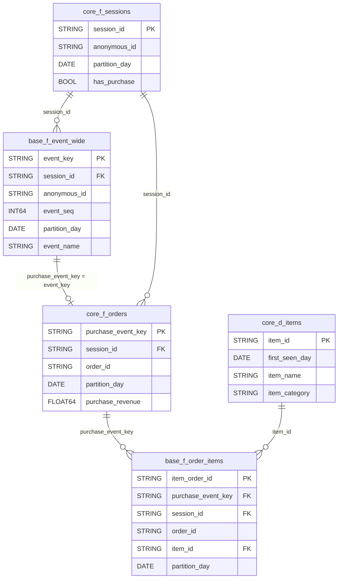

# Mart Data Dictionary

## 문서 목적

이 문서는 GA4 ecommerce 로그를 기반으로 생성한 분석용 mart의 테이블/컬럼 정의서다.

각 테이블은 다음 기준으로 설명한다.

```text
1. 한 행이 무엇을 의미하는가
2. PK/FK 또는 연결 키는 무엇인가
3. 컬럼이 원천값인지 파생값인지
4. 파생값이라면 어떤 로직으로 생성했는가
5. 분석 시 주의해야 할 점은 무엇인가
```

## 문서 사용 방법

이 문서는 BigQuery에서 mart를 조회하거나 분석 SQL을 작성할 때 기준으로 사용한다.

```text
1. Mart 목록에서 분석에 사용할 테이블을 고른다.
2. Grain을 먼저 확인한다.
3. PK와 연결 키를 확인한다.
4. 컬럼이 raw/base 값인지 derived/aggregated 값인지 확인한다.
5. 다른 mart와 JOIN할 때 row가 늘어나는 관계인지 확인한다.
6. measure를 합산하기 전에 해당 measure의 grain을 확인한다.
```

현업에서는 이런 문서를 data catalog, mart spec, table dictionary 형태로 관리한다.

이 프로젝트에서는 포트폴리오용으로 문서를 단순화했지만, 핵심은 동일하다.
테이블의 grain, key, source, business definition, join caveat을 한곳에서 확인할 수 있어야 한다.

## Documentation Rules

```text
1. 데이터에 존재하는 값과 분석자가 정의한 값을 구분한다.
2. 모든 mart는 Grain과 Primary Key를 먼저 정의한다.
3. Base field와 Derived field를 구분하고, Derived field는 생성 로직을 기록한다.
4. session/order/item처럼 서로 다른 grain을 JOIN할 때 row multiplication을 확인한다.
5. Revenue, Order Count, Session Count 등 핵심 measure는 JOIN 이후 중복 집계되지 않도록 주의한다.
6. NULL, not set, Other, obfuscated 값은 임의로 삭제하지 않고 처리 기준을 문서화한다.
7. 동일해 보이는 개념을 검증 없이 동일시하지 않는다.
8. 대표값 선정이 필요한 컬럼은 first/last/max/min 등 선정 기준을 명시한다.
9. 정의가 변경되면 downstream mart와 metric 정의도 함께 확인한다.
```

## 컬럼 정의 기준

| 항목 | 의미 |
|---|---|
| 컬럼명 | mart에 생성된 실제 컬럼명 |
| 타입 | BigQuery 컬럼 타입 |
| 구분 | PK, FK, 원천, event_param, 파생, 집계, 대표값 등 컬럼 역할 |
| 한국어 설명 | 분석자가 이해할 수 있는 컬럼 의미 |
| NULL 기준 | BigQuery schema의 nullable 여부가 아니라 분석상 NULL 가능성과 주의 기준 |
| 주의사항 | grain, source, 해석상 주의할 점 |

컬럼의 `구분`은 아래 기준으로 해석한다.

| 구분 | 의미 |
|---|---|
| PK | mart의 한 행을 식별하는 primary key |
| FK | 다른 mart와 연결할 때 사용하는 foreign key |
| 원천 | GA4 raw field에서 직접 가져온 값 |
| event_param | GA4 `event_params` key-value에서 추출한 값 |
| 원천 ecommerce | GA4 `ecommerce` 구조에서 직접 가져온 값 |
| 원천 item | GA4 `items` 배열에서 직접 가져온 값 |
| 파생 | 분석 편의를 위해 생성한 값 |
| 대표값 | event-level 값을 session/order/item grain으로 요약할 때 선택한 값 |
| 집계 측정값 | count, sum, min, max 등으로 계산한 measure |

## Layer 구조

```text
Raw
-> Base Mart
-> Core Mart
-> Analysis Mart
```

| Layer | 설명 |
|---|---|
| Raw | GA4 원천 이벤트 로그. 중첩 필드와 key-value 구조가 그대로 존재 |
| Base Mart | 원천 로그를 분석 가능한 기본 grain으로 펼친 source-close layer |
| Core Mart | 반복 분석에 필요한 session/order/item 단위를 표준화한 layer |
| Analysis Mart | 특정 분석 질문에 답하기 위해 목적별로 집계한 layer |

## Mart 목록

현재 프로젝트의 mart는 행동 로그 fact와 주문/상품 fact를 분리하고, 반복 분석에 필요한 core mart를 그 위에 구성한다.

| Layer | Mart | 유형 | Grain | PK | 주요 연결 키 | 설명 |
|---|---|---|---|---|---|---|
| Base | base_f_event_wide | Fact | 이벤트 1개 | event_key | session_id | GA4 이벤트 로그를 event grain으로 펼친 source-close 테이블 |
| Base | base_f_order_items | Fact | purchase 이벤트 x 상품 1개 | item_order_id | purchase_event_key, session_id, order_id, item_id | 구매 이벤트의 items 배열을 상품 row 단위로 펼친 테이블 |
| Core | core_f_sessions | Fact | 세션 1개 | session_id | anonymous_id | 세션 단위 행동, 유입, 전환 여부를 집계한 테이블 |
| Core | core_f_orders | Fact | purchase 이벤트 1개 | purchase_event_key | session_id, order_id | GA4 purchase 이벤트를 operational order로 정의한 주문 테이블 |
| Core | core_d_items | Dimension | 관측된 item_id 1개 | item_id | item_id | 구매 로그에서 관측된 상품 속성 dimension |

## 관계 다이어그램



관계 해석:

| 관계 | 의미 | 주의사항 |
|---|---|---|
| core_f_sessions 1 : N base_f_event_wide | 한 세션에는 여러 이벤트가 발생할 수 있음 | 퍼널은 event count가 아니라 session 단위 distinct 기준으로 계산 |
| base_f_event_wide 1 : 0/1 core_f_orders | purchase 이벤트만 order로 승격됨 | 모든 event가 order를 갖는 것은 아님 |
| core_f_sessions 1 : N core_f_orders | 한 세션에서 여러 purchase 이벤트가 발생할 수 있음 | session CVR과 order count를 구분 |
| core_f_orders 1 : N base_f_order_items | 한 주문 이벤트 안에 여러 상품 row가 있을 수 있음 | order revenue를 item table과 조인해 합산하면 중복 가능 |
| core_d_items 1 : N base_f_order_items | 하나의 item_id는 여러 주문상품 row에 등장 가능 | core_d_items는 실제 product master가 아니라 관측 상품 dimension |

## Base Mart

Base mart는 raw GA4 로그를 최대한 원천에 가깝게 유지하되, 분석이 가능하도록 key 생성, repeated field 해제, 문자열 정규화, 파티셔닝을 적용한 테이블이다.

### base_f_event_wide

사용자 행동 로그를 이벤트 단위로 펼친 base fact다.

`event_params`의 주요 key-value 값을 컬럼으로 펼쳤고, `items` 배열은 event grain을 깨지 않기 위해 상품 상세 row로 풀지 않는다.

| 항목 | 내용 |
|---|---|
| 역할 | 사용자 행동 로그 base fact |
| Grain | 1 row = GA4 이벤트 1개 |
| Primary Key | event_key |
| Foreign Key | session_id |
| Partition | partition_day |
| Source | `bigquery-public-data.ga4_obfuscated_sample_ecommerce.events_*` |
| 주요 파생 로직 | event_key 생성, session_id 생성, event_seq 생성, event_params wide 변환 |
| 주요 사용처 | 이벤트 EDA, 행동 시퀀스, funnel step 검증, landing page/session mart 생성 |
| 주의사항 | item 배열은 펼치지 않음. 상품 단위 분석은 `base_f_order_items` 또는 `core_d_items` 사용 |

| 컬럼명 | 타입 | 구분 | 한국어 설명 |
|---|---:|---|---|
| event_key | STRING | 파생 PK | 이벤트 1개를 식별하기 위해 생성한 분석용 고유 키 |
| event_seq | INT64 | 파생 순번 | 동일 세션 안에서 이벤트 발생 순서를 재현하기 위해 생성한 순번 |
| partition_day | DATE | 파생 날짜 | 이벤트 발생 일자. BigQuery 파티션 기준 |
| event_at | TIMESTAMP | 파생 시간 | `event_timestamp`를 timestamp 형식으로 변환한 이벤트 발생 시각 |
| event_timestamp | INT64 | 원천 | GA4 원천의 이벤트 발생 timestamp |
| event_bundle_sequence_id | INT64 | 원천 | GA4 원천의 event bundle sequence 값 |
| event_name | STRING | 원천 | 이벤트명. 사용자가 수행한 행동 종류 |
| anonymous_id | STRING | 원천 key | GA4 `user_pseudo_id`. 익명 사용자/기기 식별자 |
| user_first_touch_at | TIMESTAMP | 파생 시간 | 해당 익명 사용자가 처음 관측된 시각 |
| platform | STRING | 원천 | 이벤트가 발생한 플랫폼 |
| hostname | STRING | 원천 | 이벤트가 발생한 host 이름 |
| ga_session_id | INT64 | event_param | GA4가 부여한 세션 ID 값 |
| ga_session_number | INT64 | event_param | 해당 익명 사용자의 세션 순번 |
| session_id | STRING | 파생 FK | `anonymous_id + ga_session_id`로 생성한 분석용 세션 키 |
| device_category | STRING | 원천 | 기기 유형. 예: desktop, mobile, tablet |
| operating_system | STRING | 원천 | 사용자 기기의 운영체제 |
| operating_system_version | STRING | 원천 | 사용자 기기의 운영체제 버전 |
| language | STRING | 원천 | 브라우저 또는 기기 언어 설정 |
| browser | STRING | 원천 | 사용자가 이용한 브라우저 |
| browser_version | STRING | 원천 | 사용자가 이용한 브라우저 버전 |
| country | STRING | 원천 | GA4가 추정한 사용자 국가 |
| region | STRING | 원천 | GA4가 추정한 사용자 지역 |
| city | STRING | 원천 | GA4가 추정한 사용자 도시 |
| traffic_source | STRING | 원천 | 사용자 최초 유입 source |
| traffic_medium | STRING | 원천 | 사용자 최초 유입 medium |
| traffic_campaign | STRING | 원천 | 사용자 최초 유입 campaign |
| event_param_source | STRING | event_param | 이벤트 파라미터에 기록된 source |
| event_param_medium | STRING | event_param | 이벤트 파라미터에 기록된 medium |
| event_param_campaign | STRING | event_param | 이벤트 파라미터에 기록된 campaign |
| page_location | STRING | event_param | 이벤트가 발생한 페이지 URL |
| page_title | STRING | event_param | 이벤트가 발생한 페이지 title |
| page_referrer | STRING | event_param | 이벤트 직전 referrer URL |
| engagement_time_msec | INT64 | event_param | 이벤트에 기록된 engagement time. 단위는 millisecond |
| engaged_session_event | INT64 | event_param | GA4가 engaged session 관련 이벤트로 표시한 값 |
| session_engaged | STRING | event_param | GA4의 session engaged 여부를 나타내는 값 |
| percent_scrolled | INT64 | event_param | scroll 이벤트에서 기록된 스크롤 비율 |
| entrances | INT64 | event_param | 세션 진입 페이지 여부. landing page 산출에 사용 |
| term | STRING | event_param | 검색어 또는 유입 키워드 관련 값 |
| search_term | STRING | event_param | 사이트 내 검색어. public dataset에서는 비식별 값 존재 |
| unique_search_term | INT64 | event_param | 검색어 고유 여부 또는 검색 관련 보조 값 |
| event_currency | STRING | event_param | 이벤트에 기록된 통화 코드 |
| event_value | FLOAT64 | event_param | 이벤트에 기록된 value 값. 구매 이벤트에서는 거래 금액 후보 |
| event_tax | FLOAT64 | event_param | 이벤트에 기록된 세금 값 |
| event_param_transaction_id | STRING | event_param | event_params에 기록된 transaction ID |
| payment_type | STRING | event_param | 결제 방식 |
| shipping_tier | STRING | event_param | 배송 옵션 또는 배송 등급 |
| event_coupon | STRING | event_param | 이벤트에 기록된 쿠폰명 또는 쿠폰 코드 |
| event_promotion_name | STRING | event_param | 이벤트에 기록된 프로모션 이름 |
| link_url | STRING | event_param | click 이벤트에서 기록된 클릭 링크 URL |
| link_domain | STRING | event_param | click 이벤트에서 기록된 클릭 링크 domain |
| outbound | STRING | event_param | click 이벤트가 외부 이동인지 나타내는 값 |
| total_item_quantity | INT64 | 원천 ecommerce | purchase 이벤트의 총 상품 수량 |
| purchase_revenue | FLOAT64 | 원천 ecommerce | purchase 이벤트에 기록된 구매 매출 |
| refund_value | FLOAT64 | 원천 ecommerce | 환불 금액 |
| shipping_value | FLOAT64 | 원천 ecommerce | 배송 금액 |
| tax_value | FLOAT64 | 원천 ecommerce | 세금 금액 |
| unique_items | INT64 | 원천 ecommerce | purchase 이벤트의 고유 상품 수 |
| transaction_id | STRING | 원천 ecommerce | ecommerce 구조에 기록된 transaction ID |
| item_row_count | INT64 | 파생 측정값 | 해당 이벤트의 `items` 배열 row 수 |

### base_f_order_items

구매 이벤트에 포함된 `items` 배열을 상품 row 단위로 펼친 base fact다. 상품/카테고리별 매출과 구매상품 구성을 분석할 때 사용한다.

| 항목 | 내용 |
|---|---|
| 역할 | 주문상품 base fact |
| Grain | 1 row = purchase 이벤트 x 상품 1개 |
| Primary Key | item_order_id |
| Foreign Key | purchase_event_key, session_id, item_id |
| Partition | partition_day |
| Source | `events_*` 중 `event_name = 'purchase'` + `items` 배열 UNNEST |
| 주요 파생 로직 | item_order_id 생성, purchase_event_key 생성, item_seq 생성, purchase item array UNNEST |
| 주요 사용처 | 상품별 매출, 카테고리별 매출, 주문 내 상품 구성 분석 |
| 주의사항 | `purchase_revenue`는 order-level 값이므로 이 테이블에서 합산하면 중복 가능. 상품 매출은 `item_revenue` 기준 |

| 컬럼명 | 타입 | 구분 | 한국어 설명 |
|---|---:|---|---|
| item_order_id | STRING | 파생 PK | 구매 이벤트 안의 상품 row 1개를 식별하는 분석용 고유 키 |
| purchase_event_key | STRING | 파생 FK | 해당 상품 row가 속한 purchase 이벤트 키 |
| order_id | STRING | 파생 key | 현재 public GA4 기준 operational order key. `purchase_event_key`와 동일 |
| session_id | STRING | 파생 FK | 구매 이벤트가 발생한 세션 키 |
| anonymous_id | STRING | 원천 key | GA4 `user_pseudo_id`. 익명 사용자/기기 식별자 |
| partition_day | DATE | 파생 날짜 | 구매 이벤트 발생 일자. BigQuery 파티션 기준 |
| order_event_at | TIMESTAMP | 파생 시간 | 구매 이벤트 발생 시각 |
| event_name | STRING | 원천 | 구매 이벤트명. 이 테이블에서는 `purchase` |
| transaction_id | STRING | 원천 ecommerce | ecommerce 구조에 기록된 transaction ID |
| event_param_transaction_id | STRING | event_param | event_params에 기록된 transaction ID |
| currency | STRING | event_param | 구매 이벤트에 기록된 통화 코드 |
| payment_type | STRING | event_param | 결제 방식 |
| shipping_tier | STRING | event_param | 배송 옵션 또는 배송 등급 |
| order_coupon | STRING | event_param | 주문 이벤트에 기록된 쿠폰명 또는 쿠폰 코드 |
| order_promotion_name | STRING | event_param | 주문 이벤트에 기록된 프로모션 이름 |
| purchase_revenue | FLOAT64 | 원천 ecommerce | purchase 이벤트 단위 구매 매출 |
| item_seq | INT64 | 파생 순번 | purchase 이벤트 안에서 상품 row가 몇 번째인지 나타내는 배열 순번 |
| item_id | STRING | 원천 item | 상품 ID |
| item_name | STRING | 원천 item | 상품명 |
| item_brand | STRING | 원천 item | 상품 브랜드 |
| item_variant | STRING | 원천 item | 상품 옵션 또는 변형 정보 |
| item_category | STRING | 원천 item | 상품 카테고리 |
| price | FLOAT64 | 원천 item | 상품 단가 |
| quantity | INT64 | 원천 item | 구매 수량 |
| item_revenue | FLOAT64 | 원천 item | 해당 상품 row의 매출 |
| item_refund | FLOAT64 | 원천 item | 해당 상품 row의 환불 금액 |
| item_coupon | STRING | 원천 item | 상품 row에 적용된 쿠폰 |
| item_list_name | STRING | 원천 item | 상품이 노출된 리스트 이름 |
| promotion_id | STRING | 원천 item | 상품 row에 연결된 프로모션 ID |
| item_promotion_name | STRING | 원천 item | 상품 row에 연결된 프로모션 이름 |
| device_category | STRING | 원천 | 구매 이벤트가 발생한 기기 유형 |
| operating_system | STRING | 원천 | 구매 이벤트가 발생한 기기의 운영체제 |
| browser | STRING | 원천 | 구매 이벤트가 발생한 브라우저 |
| country | STRING | 원천 | 구매 이벤트가 발생한 사용자 국가 |
| city | STRING | 원천 | 구매 이벤트가 발생한 사용자 도시 |
| traffic_source | STRING | 원천 | 구매 사용자의 최초 유입 source |
| traffic_medium | STRING | 원천 | 구매 사용자의 최초 유입 medium |
| traffic_campaign | STRING | 원천 | 구매 사용자의 최초 유입 campaign |

## Core Mart

Core mart는 base mart를 session/order/item 같은 반복 분석 단위로 집계한 테이블이다. 이 layer부터는 집계 및 파생 컬럼이 포함된다.

### core_f_sessions

세션 단위 사용자 행동, 유입 정보, 전환 여부를 반복 분석하기 위해 집계한 core fact다.

| 항목 | 내용 |
|---|---|
| 역할 | 세션 단위 core fact |
| Grain | 1 row = 세션 1개 |
| Primary Key | session_id |
| Foreign Key | anonymous_id |
| Partition | partition_day |
| Source | base_f_event_wide |
| 주요 사용처 | session CVR, 유입 기준 전환율, funnel, 행동 신호 비교 |
| 주요 집계 로직 | 세션 내 이벤트 count, 세션 시작/종료 시각, 첫 번째 non-null 대표값, landing page, 행동 발생 여부 flag |
| 주의사항 | 대표값 컬럼은 event-level 값을 session-level로 요약한 값 |

| 컬럼명 | 타입 | 구분 | 한국어 설명 |
|---|---:|---|---|
| session_id | STRING | PK | 분석용 세션 키 |
| anonymous_id | STRING | 대표값 | 세션 내 첫 번째 익명 사용자 ID |
| partition_day | DATE | 집계 | 세션 내 가장 이른 이벤트 발생 일자 |
| session_start_at | TIMESTAMP | 집계 | 세션 내 첫 이벤트 발생 시각 |
| session_end_at | TIMESTAMP | 집계 | 세션 내 마지막 이벤트 발생 시각 |
| session_duration_sec | INT64 | 파생 측정값 | `session_end_at - session_start_at`으로 계산한 세션 길이 |
| ga_session_id | INT64 | 대표값 | 세션 내 첫 번째 GA4 session ID |
| ga_session_number | INT64 | 대표값 | 세션 내 첫 번째 GA4 session number |
| user_first_touch_at | TIMESTAMP | 대표값 | 해당 익명 사용자의 최초 관측 시각 |
| platform | STRING | 대표값 | 세션 내 첫 번째 플랫폼 |
| hostname | STRING | 대표값 | 세션 내 첫 번째 host 이름 |
| device_category | STRING | 대표값 | 세션 내 첫 번째 기기 유형 |
| operating_system | STRING | 대표값 | 세션 내 첫 번째 운영체제 |
| browser | STRING | 대표값 | 세션 내 첫 번째 브라우저 |
| country | STRING | 대표값 | 세션 내 첫 번째 국가 |
| region | STRING | 대표값 | 세션 내 첫 번째 지역 |
| city | STRING | 대표값 | 세션 내 첫 번째 도시 |
| traffic_source | STRING | 대표값 | 세션 내 첫 번째 사용자 최초 유입 source |
| traffic_medium | STRING | 대표값 | 세션 내 첫 번째 사용자 최초 유입 medium |
| traffic_campaign | STRING | 대표값 | 세션 내 첫 번째 사용자 최초 유입 campaign |
| event_param_source | STRING | 대표값 | 세션 내 첫 번째 이벤트 파라미터 source |
| event_param_medium | STRING | 대표값 | 세션 내 첫 번째 이벤트 파라미터 medium |
| event_param_campaign | STRING | 대표값 | 세션 내 첫 번째 이벤트 파라미터 campaign |
| landing_page | STRING | 파생 dimension | 세션 내 `entrances = 1`인 첫 page_location |
| landing_page_title | STRING | 파생 dimension | 세션 내 `entrances = 1`인 첫 page_title |
| landing_page_referrer | STRING | 파생 dimension | 세션 내 `entrances = 1`인 첫 page_referrer |
| event_count | INT64 | 집계 측정값 | 세션 내 전체 이벤트 수 |
| page_view_count | INT64 | 집계 측정값 | 세션 내 page_view 이벤트 수 |
| view_item_count | INT64 | 집계 측정값 | 세션 내 view_item 이벤트 수 |
| select_item_count | INT64 | 집계 측정값 | 세션 내 select_item 이벤트 수 |
| add_to_cart_count | INT64 | 집계 측정값 | 세션 내 add_to_cart 이벤트 수 |
| begin_checkout_count | INT64 | 집계 측정값 | 세션 내 begin_checkout 이벤트 수 |
| purchase_count | INT64 | 집계 측정값 | 세션 내 purchase 이벤트 수 |
| search_count | INT64 | 집계 측정값 | 세션 내 view_search_results 이벤트 수 |
| scroll_count | INT64 | 집계 측정값 | 세션 내 scroll 이벤트 수 |
| engagement_time_msec | INT64 | 집계 측정값 | 세션 내 engagement_time_msec 합계 |
| max_percent_scrolled | INT64 | 집계 측정값 | 세션 내 최대 스크롤 비율 |
| has_view_item | BOOL | 파생 flag | 세션 내 view_item 이벤트가 1개 이상 있으면 TRUE |
| has_select_item | BOOL | 파생 flag | 세션 내 select_item 이벤트가 1개 이상 있으면 TRUE |
| has_add_to_cart | BOOL | 파생 flag | 세션 내 add_to_cart 이벤트가 1개 이상 있으면 TRUE |
| has_begin_checkout | BOOL | 파생 flag | 세션 내 begin_checkout 이벤트가 1개 이상 있으면 TRUE |
| has_purchase | BOOL | 파생 flag | 세션 내 purchase 이벤트가 1개 이상 있으면 TRUE |
| has_search | BOOL | 파생 flag | 세션 내 view_search_results 이벤트가 1개 이상 있으면 TRUE |
| has_scroll | BOOL | 파생 flag | 세션 내 scroll 이벤트가 1개 이상 있으면 TRUE |
| session_purchase_revenue | FLOAT64 | 집계 측정값 | 세션 내 purchase 이벤트의 purchase_revenue 합계 |
| session_total_item_quantity | INT64 | 집계 측정값 | 세션 내 purchase 이벤트의 total_item_quantity 합계 |

### core_f_orders

현재 public GA4 dataset에는 backend order table이 없으므로, `core_f_orders`의 order는 GA4 purchase 이벤트 기준 operational order다.

| 항목 | 내용 |
|---|---|
| 역할 | 주문 단위 core fact |
| Grain | 1 row = purchase 이벤트 1개 |
| Primary Key | purchase_event_key |
| Foreign Key | session_id |
| Partition | partition_day |
| Source | base_f_event_wide 중 `event_name = 'purchase'` |
| 주요 사용처 | order count, total revenue, AOV, 주문 단위 dimension 분석 |
| 주요 집계 로직 | purchase 이벤트를 주문 단위로 정의하고, item 지표는 base_f_order_items를 LEFT JOIN해 보강 |
| 주의사항 | backend order DB가 없으므로 실제 주문과 1:1이라고 단정하지 않음 |

| 컬럼명 | 타입 | 구분 | 한국어 설명 |
|---|---:|---|---|
| purchase_event_key | STRING | PK | purchase 이벤트 1개를 식별하는 키 |
| order_id | STRING | 파생 key | 현재 public GA4 기준 operational order key. `purchase_event_key`와 동일 |
| session_id | STRING | FK | 주문이 발생한 세션 키 |
| anonymous_id | STRING | 대표값 | 주문을 발생시킨 익명 사용자 ID |
| partition_day | DATE | 집계 | 주문 이벤트 발생 일자 |
| order_event_at | TIMESTAMP | 집계 | 주문 이벤트 발생 시각 |
| transaction_id | STRING | 대표값 | ecommerce 구조에 기록된 transaction ID |
| event_param_transaction_id | STRING | 대표값 | event_params에 기록된 transaction ID |
| currency | STRING | 대표값 | 주문 통화 코드 |
| payment_type | STRING | 대표값 | 결제 방식 |
| shipping_tier | STRING | 대표값 | 배송 옵션 또는 배송 등급 |
| order_coupon | STRING | 대표값 | 주문 이벤트에 기록된 쿠폰 |
| order_promotion_name | STRING | 대표값 | 주문 이벤트에 기록된 프로모션 이름 |
| purchase_revenue | FLOAT64 | 집계 측정값 | purchase 이벤트 단위 매출. 동일 구매 이벤트 내 MAX 값 사용 |
| item_revenue | FLOAT64 | 집계 측정값 | 주문에 포함된 상품 row의 item_revenue 합계 |
| item_quantity | INT64 | 집계 측정값 | 주문에 포함된 상품 수량 합계 |
| order_item_count | INT64 | 집계 측정값 | 주문에 포함된 상품 row 수 |
| distinct_item_count | INT64 | 집계 측정값 | 주문에 포함된 고유 item_id 수 |
| distinct_category_count | INT64 | 집계 측정값 | 주문에 포함된 고유 item_category 수 |
| device_category | STRING | 대표값 | 주문 이벤트가 발생한 기기 유형 |
| operating_system | STRING | 대표값 | 주문 이벤트가 발생한 운영체제 |
| browser | STRING | 대표값 | 주문 이벤트가 발생한 브라우저 |
| country | STRING | 대표값 | 주문 이벤트가 발생한 사용자 국가 |
| city | STRING | 대표값 | 주문 이벤트가 발생한 사용자 도시 |
| traffic_source | STRING | 대표값 | 주문 사용자의 최초 유입 source |
| traffic_medium | STRING | 대표값 | 주문 사용자의 최초 유입 medium |
| traffic_campaign | STRING | 대표값 | 주문 사용자의 최초 유입 campaign |

### core_d_items

`core_d_items`는 실제 상품 master DB가 아니라 GA4 purchase item log에서 관측된 상품 기준 dimension이다.

| 항목 | 내용 |
|---|---|
| 역할 | 관측 상품 dimension |
| Grain | 1 row = 관측된 item_id 1개 |
| Primary Key | item_id |
| Foreign Key | 없음 |
| Partition | first_seen_day |
| Source | base_f_order_items |
| 주요 사용처 | 상품 속성 lookup, 상품/카테고리 기준 분석의 dimension |
| 주요 집계 로직 | item_id별 최근 관측 속성, 최초/최종 관측일 |
| 주의사항 | 실제 product master가 아니며, 동일 item_id의 이름/카테고리가 변할 수 있음 |

| 컬럼명 | 타입 | 구분 | 한국어 설명 |
|---|---:|---|---|
| item_id | STRING | PK | 상품 ID |
| item_name | STRING | 대표값 | 해당 item_id에서 가장 최근 관측된 상품명 |
| item_brand | STRING | 대표값 | 해당 item_id에서 가장 최근 관측된 상품 브랜드 |
| item_variant | STRING | 대표값 | 해당 item_id에서 가장 최근 관측된 상품 옵션 또는 변형 정보 |
| item_category | STRING | 대표값 | 해당 item_id에서 가장 최근 관측된 상품 카테고리 |
| first_seen_day | DATE | 집계 날짜 | 해당 item_id가 처음 관측된 일자 |
| last_seen_day | DATE | 집계 날짜 | 해당 item_id가 마지막으로 관측된 일자 |

## 정규화 규칙

| 원천 값 형태 | 변환 결과 | 설명 |
|---|---|---|
| `(data deleted)` | NULL | 비식별/삭제 처리된 값으로 보고 분석값에서 제외 |
| `<data deleted>` | NULL | 비식별/삭제 처리된 값으로 보고 분석값에서 제외 |
| `(organic)` | `organic` | 괄호 제거 |
| `(direct)` | `direct` | 괄호 제거 |
| `(not set)` | `not set` | 괄호 제거. GA4에서 값을 확정하지 못한 상태 |
| `<Other>` | `Other` | 꺾쇠 괄호 제거 |
| `<obfuscated>` | `obfuscated` | 꺾쇠 괄호 제거. public dataset 비식별 처리 값 |

## 주요 주의사항

```text
1. anonymous_id는 실제 회원 ID가 아니라 GA4 user_pseudo_id다.
2. session_id는 anonymous_id + ga_session_id로 생성한 분석용 세션 키다.
3. purchase_event_key는 GA4 purchase 이벤트 기준 주문 식별자로 사용한다.
4. 실제 backend order DB가 없으므로 purchase 이벤트와 실제 주문의 1:1 여부는 검증할 수 없다.
5. core_d_items는 실제 product master가 아니라 purchase item log에서 관측된 상품 dimension이다.
6. core_f_orders는 base_f_event_wide의 purchase 이벤트에서 생성해 item row가 없는 purchase도 보존한다.
7. revenue 분석에서 전체 매출은 core_f_orders.purchase_revenue, 상품별 매출은 base_f_order_items.item_revenue를 기준으로 한다.
```
